# C4 Architecture Analysis: llm-pipeline

## Executive Summary

The llm-pipeline is a declarative LLM pipeline orchestration framework that uses a **Pipeline + Strategy + Step** pattern to manage complex LLM-based data extraction and transformation workflows. It combines object-oriented design (OOP) classes and interfaces with functional data transformation patterns.

**Architecture Pattern**: Hybrid OOP + Functional (Factory Pattern, Strategy Pattern, Decorator Pattern)

**Language**: Python 3.11+ with Pydantic v2, SQLModel/SQLAlchemy 2.0, PyYAML

**Core Strengths**:
- Declarative configuration of complex pipelines
- Type-safe LLM interactions via Pydantic validation
- Database-backed persistence and audit trails
- Pluggable strategies and execution methods
- Built-in caching and consensus mechanisms
- Separation of concerns: extraction, transformation, validation

---

## Module Structure

### Directory Hierarchy

```
llm_pipeline/
├── __init__.py                 # Public API exports
├── types.py                    # Shared type definitions
├── context.py                  # Base class: PipelineContext
├── extraction.py               # Base class: PipelineExtraction
├── transformation.py           # Base class: PipelineTransformation
├── registry.py                 # Base class: PipelineDatabaseRegistry
├── state.py                    # State models: PipelineStepState, PipelineRunInstance
├── pipeline.py                 # Core: PipelineConfig (main orchestrator)
├── step.py                     # Core: LLMStep, LLMResultMixin, @step_definition decorator
├── strategy.py                 # Core: PipelineStrategy, StepDefinition
├── llm/
│   ├── __init__.py
│   ├── provider.py             # Abstract: LLMProvider
│   ├── gemini.py               # Implementation: GeminiProvider
│   ├── schema.py               # LLM response schema validation
│   ├── validation.py           # LLM response validation logic
│   ├── executor.py             # Function: execute_llm_step()
│   └── rate_limiter.py         # Rate limiting for LLM calls
├── prompts/
│   ├── __init__.py
│   ├── loader.py               # Load prompts from YAML/JSON
│   ├── service.py              # Class: PromptService (DB-backed prompt retrieval)
│   └── variables.py            # PromptVariables for template substitution
├── session/
│   ├── __init__.py
│   └── readonly.py             # Class: ReadOnlySession (write-blocking wrapper)
└── db/
    ├── __init__.py
    ├── prompt.py               # Database model: Prompt
    └── [auto-created for state tracking]
```

---

## Core Classes and Relationships

### 1. Pipeline Orchestration Layer

#### PipelineConfig (Main Orchestrator)

**File**: `llm_pipeline/pipeline.py` (lines 72-844)

**Responsibility**: Orchestrates entire pipeline execution, manages state, handles caching, coordinates strategies, steps, extractions, and transformations.

**Key Methods**:
- `__init__()` - Initialize pipeline with dependencies (session, engine, provider, variable_resolver, strategies)
- `execute(data, initial_context, use_cache, consensus_polling)` - Main execution loop
- `get_data(key)` / `set_data(data, step_name)` - Step-to-step data passing
- `get_instructions(key)` - Retrieve parsed LLM instructions
- `store_extractions(model_class, instances)` - Collect extracted models
- `save(session, engine)` - Persist all extracted data to database
- `clear_cache()` - Clear execution cache
- `_build_execution_order()` - Determine step execution sequence
- `_validate_registry_order()` - Ensure extraction order respects FK dependencies
- `_validate_step_access()` - Enforce data visibility rules
- `_execute_with_consensus()` - Run step multiple times, verify agreement

**Key Properties**:
- `data: Dict[str, Any]` - Current pipeline data state
- `extractions: Dict[str, List]` - Extracted database models by type
- `session: ReadOnlySession` - DB access (read-only during execution)
- `context: PipelineContext` - Step-contributed derived values
- `run_id: str` - Unique identifier for this pipeline run

**Relationships**:
- Composes: `PipelineStrategy`, `LLMStep`, `PipelineExtraction`, `PipelineTransformation`, `PipelineContext`
- Uses: `LLMProvider`, `PromptService`, `ReadOnlySession`, `PipelineStepState`, `PipelineRunInstance`
- References: `PipelineDatabaseRegistry`, `PipelineConfig.REGISTRY` (class variable)

---

### 2. Strategy and Step Definition Layer

#### PipelineStrategy (Abstract Base Class)

**File**: `llm_pipeline/strategy.py` (lines 137-246)

**Responsibility**: Define which steps to run and when to apply this strategy. Strategies are pluggable executors.

**Key Methods**:
- `can_handle(context: Any) -> bool` - Check if strategy applies to current context
- `get_steps() -> List[StepDefinition]` - Return steps to execute (abstract)
- `name() -> str` - Strategy identifier
- `display_name() -> str` - User-friendly name

**Class Variables**:
- `NAME` - Strategy name (auto-registered via `__init_subclass__`)
- `DISPLAY_NAME` - Display name

**Relationships**:
- Subclassed by: Concrete strategy implementations (not in llm_pipeline, in consumer projects)
- Contains: `List[StepDefinition]`
- Used by: `PipelineConfig` to determine execution order

---

#### StepDefinition (DataClass)

**File**: `llm_pipeline/strategy.py` (lines 20-130)

**Responsibility**: Blueprint for a single step - connects step class with config, extractions, transformations, and context.

**Key Attributes**:
- `step_class: Type` - The LLMStep subclass to instantiate
- `system_instruction_key: str` - Database key for system prompt
- `user_prompt_key: str` - Database key for user prompt
- `instructions: Type` - Pydantic model for parsing LLM response
- `action_after: Optional[str]` - Post-processing action name
- `extractions: List[Type[PipelineExtraction]]` - Data extraction classes
- `transformation: Optional[Type[PipelineTransformation]]` - Data transformation
- `context: Optional[Type]` - Context class this step produces

**Key Methods**:
- `create_step(pipeline) -> LLMStep` - Instantiate configured step with pipeline reference

**Relationships**:
- Contains: `PipelineExtraction`, `PipelineTransformation`, `PipelineContext`
- References: `LLMStep` subclasses
- Created by: `PipelineStrategy.get_steps()`

---

#### LLMStep (Abstract Base Class)

**File**: `llm_pipeline/step.py` (lines 224-331)

**Responsibility**: Individual step implementation - handles prompt creation, LLM calls, instruction validation.

**Key Methods**:
- `__init__(system_instruction_key, user_prompt_key, instructions, pipeline)` - Initialize with config
- `step_name() -> str` - Derive step name from class name
- `create_llm_call(variables, system_instruction_key, user_prompt_key, instructions, extra_params)` - Build LLM call params
- `prepare_calls() -> StepCallParams` - Prepare call parameters (abstract, step implements)
- `process_instructions(instructions) -> PipelineContext` - Parse instructions into context (abstract)
- `should_skip() -> bool` - Determine if step should execute
- `log_instructions(instructions)` - Log instructions for debugging
- `extract_data(instructions) -> Dict[str, List]` - Extract models from instructions

**Key Properties**:
- `system_instruction_key: str` - System prompt key
- `user_prompt_key: str` - User prompt key
- `instructions: Any` - Type of instructions this step parses
- `pipeline: PipelineConfig` - Reference to parent pipeline

**Relationships**:
- Extends: `LLMResultMixin` (provides result validation mixin)
- Used by: `StepDefinition`
- Instantiated by: `PipelineConfig.execute()`
- Calls: `execute_llm_step()` (from llm.executor)

---

#### @step_definition Decorator

**File**: `llm_pipeline/step.py` (lines 73-155)

**Responsibility**: Auto-generate step definition factory with configuration validation.

**Usage**:
```python
@step_definition(
    instructions=MyInstructions,
    default_system_key="my_step.system",
    default_user_key="my_step.user",
    default_extractions=[MyExtraction],
    default_transformation=MyTransformation,
    context=MyContext
)
class MyStep(LLMStep):
    def prepare_calls(self):
        # Implementation
        pass
```

**Validation Enforced**:
- Step class name must end with "Step"
- Instructions class must be named "{StepName}Instructions"
- Transformation class must be named "{StepName}Transformation"
- Context class must be named "{StepName}Context"

---

### 3. Data Extraction and Transformation Layer

#### PipelineExtraction (Abstract Base Class)

**File**: `llm_pipeline/extraction.py` (lines 33-281)

**Responsibility**: Convert LLM results into database model instances. One extraction per model type.

**Key Methods**:
- `extract(results: List[Any]) -> List[SQLModel]` - Auto-detect and call extraction method
- `_validate_instances(instances)` - Validate extracted instances before return
- `_validate_instance(instance, index)` - Validate single instance (NaN, NULL, FK constraints)

**Class Variables**:
- `MODEL: ClassVar[Type[SQLModel]]` - The database model this extraction produces

**Method Detection Order** (in `extract()`):
1. Explicit `default()` method → use it
2. Strategy-name matching method → use matching method
3. Single custom method → use that method
4. No custom methods → error
5. Multiple methods, no default → error

**Usage**:
```python
class LaneExtraction(PipelineExtraction, model=Lane):
    def extract(self, results: List[SemanticMappingInstructions]) -> List[Lane]:
        # Extraction logic
        return lanes
```

**Relationships**:
- Configured in: `StepDefinition.extractions`
- Called by: `PipelineConfig.execute()` during step execution
- Accesses: `self.pipeline.context`, `self.pipeline.get_extractions(Model)`, `self.pipeline.session`

---

#### PipelineTransformation (Abstract Base Class)

**File**: `llm_pipeline/transformation.py` (lines 30-184)

**Responsibility**: Transform data structures (unpivot, normalize, etc.) with type validation.

**Key Methods**:
- `transform(data: Any, instructions: Any) -> Any` - Auto-detect and call transformation method
- `_validate_input(data)` - Validate input type matches INPUT_TYPE
- `_validate_output(data)` - Validate output type matches OUTPUT_TYPE

**Class Variables**:
- `INPUT_TYPE: ClassVar[Type]` - Expected input data type
- `OUTPUT_TYPE: ClassVar[Type]` - Expected output data type

**Method Detection Order** (in `transform()`):
1. Explicit `default()` method → use it
2. Single custom method → use that method
3. No custom methods → passthrough (return data unchanged)
4. Multiple methods, no default → error

**Usage**:
```python
class UnpivotTransformation(PipelineTransformation,
                           input_type=pd.DataFrame,
                           output_type=pd.DataFrame):
    def default(self, data: pd.DataFrame, instructions) -> pd.DataFrame:
        # Transformation logic
        return transformed_df
```

**Relationships**:
- Configured in: `StepDefinition.transformation`
- Called by: `PipelineConfig.execute()` after LLM call
- Receives: LLM instructions, current data, pipeline context

---

#### PipelineContext (Base Class)

**File**: `llm_pipeline/context.py` (lines 10-33)

**Responsibility**: Placeholder base class for step-specific context contributions.

**Usage**:
```python
class MyStepContext(PipelineContext):
    derived_value: str

@step_definition(context=MyStepContext)
class MyStep(LLMStep):
    def process_instructions(self, instructions) -> MyStepContext:
        return MyStepContext(derived_value=...)
```

**Relationships**:
- Subclassed by: Concrete context classes (one per step)
- Collected in: `PipelineConfig.context` (dict-like)
- Passed to: Subsequent steps via pipeline.context

---

### 4. LLM Provider and Execution Layer

#### LLMProvider (Abstract Base Class)

**File**: `llm_pipeline/llm/provider.py` (lines 11-61)

**Responsibility**: Interface for LLM APIs - defines contract all providers must fulfill.

**Key Methods**:
- `call_structured(prompt, system_instruction, result_class, max_retries, not_found_indicators, strict_types, array_validation, validation_context, **kwargs) -> Optional[Dict]` - Call LLM with structured output

**Implementation**:
- `GeminiProvider` - Google Gemini API implementation (in `llm/gemini.py`)

**Relationships**:
- Injected into: `PipelineConfig.__init__()` as `provider`
- Called by: `execute_llm_step()` function
- Used by: `LLMStep.extract_data()`

---

#### execute_llm_step() Function

**File**: `llm_pipeline/llm/executor.py` (lines 19-113+)

**Responsibility**: Generic executor for LLM-based steps - handles prompt retrieval, variable substitution, LLM calls, validation.

**Signature**:
```python
def execute_llm_step(
    system_instruction_key: str,
    user_prompt_key: str,
    variables: Any,
    result_class: Type[T],
    provider: LLMProvider,
    prompt_service: PromptService,
    context: Optional[Dict[str, Any]],
    array_validation: Optional[ArrayValidationConfig],
    system_variables: Optional[Any],
    validation_context: Optional[ValidationContext],
) -> T
```

**Flow**:
1. Get system instruction from PromptService
2. Get user prompt from PromptService (with variable substitution)
3. Call provider.call_structured() with prompts
4. Validate response with result_class (Pydantic)
5. Return validated result

**Relationships**:
- Called by: `PipelineConfig.execute()` during step execution
- Uses: `PromptService`, `LLMProvider`
- Receives: `StepCallParams` from `LLMStep.create_llm_call()`
- Returns: Pydantic model instance (validated result)

---

### 5. Database and Persistence Layer

#### PipelineDatabaseRegistry (Abstract Base Class)

**File**: `llm_pipeline/registry.py` (lines 11-78)

**Responsibility**: Declare which database models the pipeline manages and their insertion order.

**Key Methods**:
- `get_models() -> List[Type[SQLModel]]` - Get all managed models in insertion order

**Usage**:
```python
class MyRegistry(PipelineDatabaseRegistry, models=[
    Vendor,      # No dependencies
    RateCard,    # Depends on Vendor
    Lane,        # Depends on RateCard
]):
    pass
```

**Relationships**:
- Referenced by: `PipelineConfig.REGISTRY` (class variable)
- Used by: `PipelineConfig._build_execution_order()`, `PipelineConfig.save()`
- Contains: All `SQLModel` classes the pipeline creates

---

#### State Models

**File**: `llm_pipeline/state.py`

**PipelineStepState (SQLModel, table=True)**
- Audit trail of each step execution
- Fields: pipeline_name, run_id, step_name, step_number, input_hash, result_data, context_snapshot, prompt keys, execution_time_ms
- Indexes: (run_id, step_number), (pipeline_name, step_name, input_hash) for caching
- Enables: Audit trails, caching, partial regeneration

**PipelineRunInstance (SQLModel, table=True)**
- Links created database instances to pipeline runs
- Fields: run_id, model_type, model_id, created_at
- Enables: Traceability ("which run created this data?")

**Relationships**:
- Written by: `PipelineConfig._save_step_state()`, `PipelineConfig._track_created_instances()`
- Used by: `PipelineConfig._find_cached_state()` for caching
- Generic: Works with ANY pipeline, ANY model type

---

#### PromptService

**File**: `llm_pipeline/prompts/service.py` (lines 10-80+)

**Responsibility**: Retrieve LLM prompts from database with caching and context filtering.

**Key Methods**:
- `get_prompt(prompt_key, prompt_type, context, fallback) -> str` - Get prompt by key
- `get_system_instruction(step_name) -> str` - Get system instruction
- `get_user_prompt(prompt_key, variables) -> str` - Get user prompt with variable substitution
- `get_guidance(step_name, table_type) -> str` - Get guidance text

**Relationships**:
- Injected into: `PipelineConfig.__init__()`
- Used by: `execute_llm_step()` function
- Queries: `Prompt` database model

---

#### ReadOnlySession

**File**: `llm_pipeline/session/readonly.py` (lines 11-151)

**Responsibility**: SQLModel session wrapper that blocks write operations during step execution.

**Design**:
- Allows: query(), exec(), get(), execute(), scalar(), scalars()
- Blocks: add(), add_all(), delete(), flush(), commit(), merge(), refresh(), expire()

**Why**: Prevent accidental database writes during step execution. All writes deferred to `pipeline.save()`.

**Relationships**:
- Wraps: SQLAlchemy Session
- Used by: `PipelineConfig.session` during step execution
- Swapped for: Real session during `pipeline.save()`

---

### 6. Type System and Validation

#### Types Module

**File**: `llm_pipeline/types.py`

**ArrayValidationConfig** (dataclass)
- Configuration for LLM array response validation
- Fields: input_array, match_field, filter_empty_inputs, allow_reordering, strip_number_prefix

**ValidationContext** (dataclass)
- Context data passed to Pydantic validators
- Methods: get(key, default), __getitem__, __contains__, to_dict()

**StepCallParams** (TypedDict)
- Parameters from step's prepare_calls()
- Fields: variables, array_validation, validation_context

**ExecuteLLMStepParams** (TypedDict)
- Full parameters after create_llm_call() adds context
- Extends: StepCallParams
- Additional fields: system_instruction_key, user_prompt_key, result_class, context, system_variables

---

## Execution Flow

### Pipeline Execution Sequence

```
PipelineConfig.execute(data, initial_context, use_cache, consensus_polling)
│
├─ 1. Initialize: Create execution context, load strategies
│
├─ 2. Build execution order: _build_execution_order()
│   └─ Determine steps from strategies respecting FK dependencies
│
├─ 3. Main loop: for step_index in range(max_steps):
│   │
│   ├─ A. Select strategy for this step
│   ├─ B. Get StepDefinition from strategy
│   ├─ C. Create step instance: step_class.create_step(pipeline)
│   │
│   ├─ D. Check cache: _find_cached_state(step, input_hash)
│   │   └─ If cached and valid → skip execution
│   │
│   ├─ E. If not cached:
│   │   │
│   │   ├─ E1. Get instructions: prepare_calls() → ExecuteLLMStepParams
│   │   ├─ E2. Call LLM: execute_llm_step(params) → results
│   │   ├─ E3. Validate instructions: process_instructions(results)
│   │   ├─ E4. Save execution state: _save_step_state()
│   │   │
│   │   ├─ E5. Transformation: PipelineTransformation.transform(data, instructions)
│   │   ├─ E6. Extraction: For each PipelineExtraction:
│   │   │    extract(results) → List[SQLModel]
│   │   │    store in self.extractions[model_class]
│   │   │
│   │   ├─ E7. Optional consensus: If consensus_polling:
│   │   │    _execute_with_consensus() → validate agreement
│   │   │
│   │   └─ E8. Optional action: Call action_after() if defined
│   │
│   └─ F. Move to next step
│
├─ 4. Persist: save(session, engine)
│   └─ For each extracted model, insert to DB in registry order
│
└─ 5. Track: Track created instances in PipelineRunInstance
```

### Data Flow Through Pipeline

```
Input Data
    │
    ├─ Stored in: PipelineConfig.data['raw']
    │
    ├─→ Step 1 (Strategy A)
    │   ├─ prepare_calls() → prompt variables
    │   ├─ execute_llm_step() → LLM result
    │   ├─ transform() → data[step_1]
    │   ├─ extract() → extractions[Model1]
    │   └─ process_instructions() → context[step_1]
    │
    ├─→ Step 2 (Strategy B)
    │   ├─ prepare_calls(context=pipeline.context) → prompt variables
    │   ├─ execute_llm_step() → LLM result
    │   ├─ transform() → data[step_2]
    │   ├─ extract() → extractions[Model2]
    │   └─ process_instructions() → context[step_2]
    │
    └─→ Save Phase
        ├─ Validate all extracted instances
        ├─ Insert to DB in registry order (respecting FKs)
        └─ Track instances in PipelineRunInstance
```

---

## Design Patterns Used

### 1. **Factory Pattern**
- `StepDefinition.create_step()` - Factory method to instantiate configured steps
- `@step_definition` decorator - Factory decorator for step definitions

### 2. **Strategy Pattern**
- `PipelineStrategy` - Multiple strategies select different step sequences
- `PipelineConfig` - Context that uses current strategy

### 3. **Template Method Pattern**
- `LLMStep.extract_data()` - Template calls abstract `prepare_calls()`, `process_instructions()`
- `PipelineExtraction.extract()` - Template auto-detects method to call

### 4. **Decorator Pattern**
- `@step_definition` - Decorates step class with metadata
- `ReadOnlySession` - Wraps session to restrict operations

### 5. **Abstract Base Class (ABC) Pattern**
- `LLMProvider` - Abstract interface for providers
- `PipelineStrategy` - Abstract strategy interface
- `LLMStep` - Abstract step base class
- `PipelineExtraction`, `PipelineTransformation`, `PipelineDatabaseRegistry` - Abstract base classes

### 6. **Builder Pattern**
- `PipelineConfig.__init__()` - Builds pipeline from components (session, engine, provider, etc.)

### 7. **Visitor Pattern**
- Extraction/Transformation classes "visit" LLM results to extract/transform data

---

## Key Dependencies and Imports

### External Dependencies
- **pydantic** v2 - Data validation (BaseModel, ValidationError)
- **sqlmodel** - ORM for database models (SQLModel, Session)
- **sqlalchemy** 2.0 - SQL toolkit (Column, Index, ForeignKey)
- **google-generativeai** - Google Gemini API (optional)
- **PyYAML** - YAML prompt loading
- **logging** - Standard logging

### Internal Dependency Graph

```
PipelineConfig (core)
├─ PipelineStrategy + StepDefinition
│  └─ LLMStep
│     ├─ execute_llm_step() [llm.executor]
│     │  ├─ LLMProvider
│     │  ├─ PromptService
│     │  └─ Pydantic validation
│     ├─ LLMResultMixin
│     └─ step_definition decorator
├─ PipelineExtraction
├─ PipelineTransformation
├─ PipelineContext
├─ PipelineDatabaseRegistry
├─ PipelineStepState, PipelineRunInstance [state]
├─ ReadOnlySession [session]
└─ LLMProvider
   └─ GeminiProvider [llm.gemini]

PromptService
└─ Prompt [db.prompt]

ArrayValidationConfig, ValidationContext [types]
```

---

## Code-Level Interfaces

### Main Public API

**From `llm_pipeline/__init__.py`:**

```python
# Core orchestration
from llm_pipeline.pipeline import PipelineConfig
from llm_pipeline.step import LLMStep, LLMResultMixin, step_definition
from llm_pipeline.strategy import PipelineStrategy, PipelineStrategies, StepDefinition

# Data handling
from llm_pipeline.context import PipelineContext
from llm_pipeline.extraction import PipelineExtraction
from llm_pipeline.transformation import PipelineTransformation
from llm_pipeline.registry import PipelineDatabaseRegistry

# State and types
from llm_pipeline.state import PipelineStepState, PipelineRunInstance
from llm_pipeline.types import ArrayValidationConfig, ValidationContext

# Database and session
from llm_pipeline.db import init_pipeline_db
from llm_pipeline.session import ReadOnlySession

# LLM provider interface
from llm_pipeline.llm import LLMProvider
from llm_pipeline.llm.gemini import GeminiProvider
```

---

## Critical Design Decisions

### 1. **Execution Separation**
- **Steps execute read-only**: `ReadOnlySession` prevents accidental writes
- **All writes deferred to save()**: Ensures transactional safety, partial regeneration

### 2. **Strategy-Driven Execution**
- Steps selected dynamically by strategy's `get_steps()` and `can_handle()`
- Enables multiple execution paths for same pipeline

### 3. **Database Registry Ordering**
- `PipelineDatabaseRegistry` declares insertion order
- Pipeline validates FK dependencies don't violate this order
- Prevents "insert parent after child" errors

### 4. **Auto-Detection over Configuration**
- `PipelineExtraction.extract()` auto-detects method:
  - `default()` method → always used
  - Strategy-name method → matched by strategy
  - Single method → auto-selected
- Reduces boilerplate while supporting flexibility

### 5. **Caching via Input Hash**
- `PipelineStepState.input_hash` computed from step inputs
- Cache miss on prompt version change (FK dependencies)
- Enables partial regeneration: re-run step N onwards

### 6. **Consensus Mechanism**
- `_execute_with_consensus()` - Run step multiple times, verify agreement
- Optionally increase confidence in LLM results
- Configurable threshold

---

## Extension Points

### For Users Creating Pipelines:

1. **Define Custom Strategy**: Subclass `PipelineStrategy`, implement `get_steps()`, `can_handle()`
2. **Define Custom Steps**: Subclass `LLMStep`, implement `prepare_calls()`, `process_instructions()`
3. **Define Custom Extractions**: Subclass `PipelineExtraction`, implement extraction method
4. **Define Custom Transformations**: Subclass `PipelineTransformation`, implement transformation method
5. **Define Custom Context**: Subclass `PipelineContext`, add fields
6. **Define Database Registry**: Subclass `PipelineDatabaseRegistry`, declare models

### For Framework Extenders:

1. **Implement LLM Provider**: Subclass `LLMProvider`, implement `call_structured()`
2. **Custom Execution**: Subclass `PipelineConfig`, override `execute()`
3. **Custom Step Logic**: Extend `LLMStep` with pre/post hooks

---

## Summary Table: Core Classes

| Class | File | Purpose | Inheritance | Key Methods |
|-------|------|---------|-------------|------------|
| PipelineConfig | pipeline.py | Main orchestrator | ABC | execute(), save(), get_data(), store_extractions() |
| PipelineStrategy | strategy.py | Step selector | ABC | get_steps(), can_handle() |
| StepDefinition | strategy.py | Step blueprint | dataclass | create_step() |
| LLMStep | step.py | Individual step | ABC | prepare_calls(), process_instructions(), extract_data() |
| PipelineExtraction | extraction.py | Data extractor | ABC | extract() |
| PipelineTransformation | transformation.py | Data transformer | ABC | transform() |
| PipelineContext | context.py | Context base | BaseModel | (none - just data) |
| PipelineDatabaseRegistry | registry.py | Model registry | ABC | get_models() |
| LLMProvider | llm/provider.py | LLM interface | ABC | call_structured() |
| PromptService | prompts/service.py | Prompt retriever | - | get_prompt(), get_user_prompt(), get_system_prompt() |
| ReadOnlySession | session/readonly.py | Session wrapper | - | exec(), query(), get() [+ blocked writes] |
| PipelineStepState | state.py | State tracking | SQLModel | (ORM model) |
| PipelineRunInstance | state.py | Run tracking | SQLModel | (ORM model) |

---

## Mermaid Class Diagram

```mermaid
---
title: llm-pipeline Core Architecture
---
classDiagram
    namespace Pipeline {
        class PipelineConfig {
            +data: Dict
            +extractions: Dict
            +session: ReadOnlySession
            +context: PipelineContext
            +run_id: str
            +execute(data, context)
            +save(session, engine)
            +get_data(key)
            +set_data(data, step_name)
            +store_extractions(model, instances)
            +_build_execution_order()
            -_execute_with_consensus()
            -_find_cached_state()
        }

        class PipelineStrategy {
            <<abstract>>
            +get_steps() List~StepDefinition~
            +can_handle(context) bool
        }

        class StepDefinition {
            +step_class: Type
            +instructions: Type
            +extractions: List~PipelineExtraction~
            +transformation: PipelineTransformation
            +context: PipelineContext
            +create_step(pipeline)
        }
    }

    namespace Steps {
        class LLMStep {
            <<abstract>>
            -pipeline: PipelineConfig
            -instructions: Type
            +prepare_calls() StepCallParams
            +process_instructions() PipelineContext
            +extract_data(instructions)
            +create_llm_call()
        }

        class LLMResultMixin {
            <<mixin>>
        }
    }

    namespace Extraction {
        class PipelineExtraction {
            <<abstract>>
            #MODEL: Type~SQLModel~
            -pipeline: PipelineConfig
            +extract(results) List~SQLModel~
            #_validate_instances(instances)
        }
    }

    namespace Transformation {
        class PipelineTransformation {
            <<abstract>>
            #INPUT_TYPE: Type
            #OUTPUT_TYPE: Type
            -pipeline: PipelineConfig
            +transform(data, instructions) Any
        }
    }

    namespace Context {
        class PipelineContext {
            <<base>>
        }
    }

    namespace LLM {
        class LLMProvider {
            <<abstract>>
            +call_structured(prompt, system, result_class) Dict
        }

        class GeminiProvider {
            +call_structured()
        }

        class execute_llm_step {
            <<function>>
        }
    }

    namespace Database {
        class PipelineDatabaseRegistry {
            <<abstract>>
            #MODELS: List~Type~
            +get_models()
        }

        class PipelineStepState {
            +id: int
            +pipeline_name: str
            +run_id: str
            +step_name: str
            +input_hash: str
            +result_data: dict
        }

        class PipelineRunInstance {
            +id: int
            +run_id: str
            +model_type: str
            +model_id: int
        }
    }

    namespace Session {
        class ReadOnlySession {
            -_session: Session
            +exec()
            +query()
            +get()
            -add() RuntimeError
            -commit() RuntimeError
        }
    }

    namespace Prompt {
        class PromptService {
            -session: Session
            +get_prompt(key)
            +get_user_prompt(key)
            +get_system_prompt(key)
        }
    }

    %% Relationships
    PipelineConfig "1" *-- "*" PipelineStrategy
    PipelineConfig "1" *-- "*" StepDefinition
    PipelineConfig "1" o-- "1" PipelineDatabaseRegistry
    PipelineConfig "1" *-- "*" PipelineExtraction
    PipelineConfig "1" *-- "*" PipelineTransformation
    PipelineConfig "1" *-- "1" PipelineContext
    PipelineConfig "1" -- "1" ReadOnlySession

    StepDefinition "1" *-- "1" LLMStep
    StepDefinition "1" *-- "*" PipelineExtraction
    StepDefinition "1" *-- "0..1" PipelineTransformation
    StepDefinition "1" *-- "0..1" PipelineContext

    LLMStep "1" -- "1" PipelineConfig
    LLMStep --|> LLMResultMixin

    PipelineExtraction "1" -- "1" PipelineConfig
    PipelineExtraction "1" --> "1" SQLModel : produces

    PipelineTransformation "1" -- "1" PipelineConfig

    LLMProvider "1" -- "*" execute_llm_step
    GeminiProvider --|> LLMProvider

    PipelineStepState --|> SQLModel
    PipelineRunInstance --|> SQLModel

    PromptService "1" -- "1" ReadOnlySession
```



---

## Next Steps for Higher-Level C4 Diagrams

### Component Level (C3)
- **Core Pipeline Component**: PipelineConfig + Strategy + Step
- **Extraction Component**: PipelineExtraction classes
- **Database Component**: SQLModel + PipelineStepState + Registry
- **LLM Component**: LLMProvider + execute_llm_step()
- **Prompt Component**: PromptService + Database prompts

### Container Level (C2)
- **Pipeline Executor** (Python library)
- **Database** (SQL database for state + prompts)
- **LLM API** (Google Gemini / other provider)
- **Prompt Repository** (Database or YAML files)

### System Context Level (C1)
- **Data Input** (User application)
- **LLM Pipeline** (This system)
- **Database System** (Persistence)
- **External LLM API** (Google Gemini, etc.)

